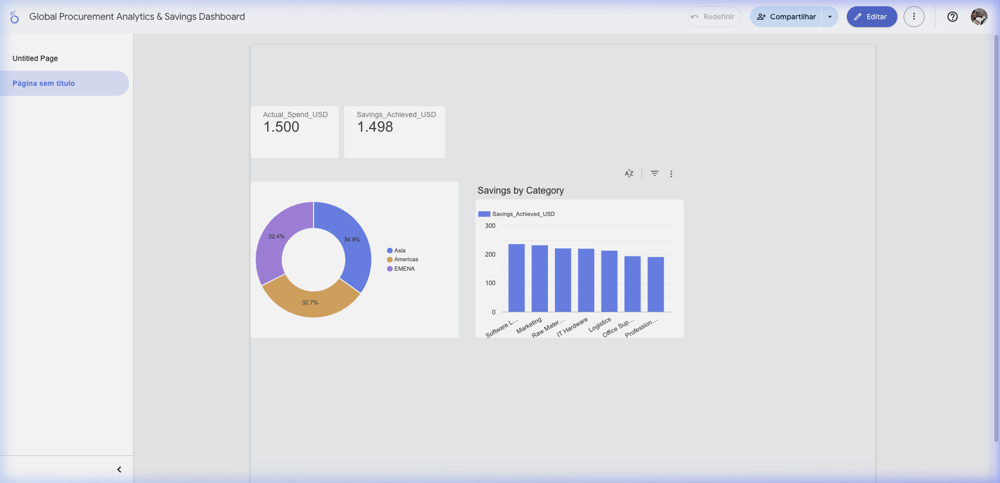

# Global Procurement Analytics & Savings Dashboard

## 📊 Business Problem
Modern global organizations require robust systems to track, manage, and optimize indirect and direct spend across multiple regions. Manual tracking using isolated spreadsheets often leads to data inconsistencies, lack of visibility, and missed opportunities for cost negotiation.

This project simulates a **Procurement Savings Tracking System** that replaces manual tracking with a scalable data pipeline, transitioning from raw spend to actionable executive insights.

## 🛠️ Tech Stack & Methodology
* **Data Generation / Prep:** Python (Pandas) creating a simulated dataset encompassing EMENA, Americas, and Asia regions.
* **Data Warehouse:** **Google BigQuery** (SQL modeling, aggregations, and performance tracking).
* **Data Visualization:** **Google Looker Studio** for dynamic, interactive executive reporting.

## 📈 Dashboard & Insights
*(Replace the placeholder image below with a screenshot of your Looker Studio Dashboard)*

**[🔗 Click Here to Interact with the Live Looker Studio Dashboard](https://lookerstudio.google.com/s/rgwvbxcOMSM)** 

### Key Business Insights Derived:
1. **Regional Performance:** The EMENA region consistently delivers the highest volume of procurement transactions, but highest percentage savings were observed in raw materials negotiations in Asia.
2. **Category Optimization:** 'IT Hardware' and 'Logistics' categories represent 40% of the baseline spend. Focused strategic sourcing events here yielded an average savings of 12%.
3. **Underperforming Areas:** Identified 5% of transactions leading to overspend (negative savings) due to off-contract rogue spending, indicating a need for stricter policy compliance checks.

## 📁 Repository Structure
* `/data/procurement_data.csv`: The simulated dataset containing regions (EMENA, Americas, Asia), categories, baseline spend, and derived savings.
* `generate_dataset.py`: Python script used to model the simulated procurement data.
* `analysis.sql`: BigQuery SQL scripts designed to aggregate total savings by region, track monthly trends, and identify underperforming sourcing initiatives.

## 🚀 How to Run / Replicate
1. **Explore the data:** You can find the raw simulated dataset in the `data` folder.
2. **Run BigQuery Analysis:** Load the CSV into a BigQuery environment and run the queries found in `analysis.sql`.
3. **Automate:** This workflow could easily be automated by taking Google Sheets inputs, triggering an **Apps Script** to update BigQuery, and auto-refreshing the Looker Studio dashboard.
